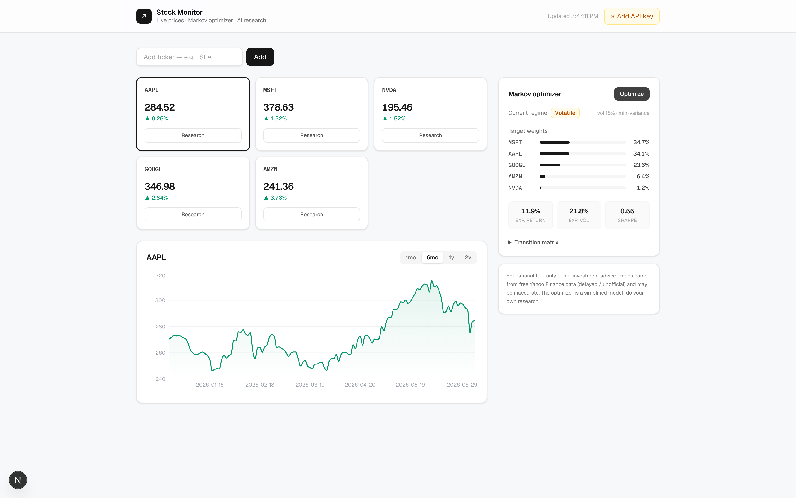

# 📈 Stock Monitor

An open-source finance dashboard: a **live stock watchlist**, a **Markov-regime portfolio
optimizer**, and a **bring-your-own-key AI stock researcher** — in one clean Next.js app.



> ⚠️ **Educational tool, not investment advice.** Price data comes from the free, unofficial
> Yahoo Finance endpoints (via `yahoo-finance2`) and may be delayed or wrong. It does not
> place trades or connect to a broker.

## How it works

The screenshot above shows the three features working together:

1. **Live monitor (tiles).** Add tickers to a watchlist; each tile shows the latest price and
   % change, refreshing every ~8 seconds. Click a tile to load its chart; click **Research**
   to open the AI brief. The watchlist persists in your browser.
2. **Markov optimizer (right panel).** Click **Optimize** and it (a) detects the current
   market regime — **Bull / Bear / Volatile** — with a first-order Markov chain on SPY, then
   (b) runs a Markowitz mean-variance optimization to suggest portfolio **weights**, plus
   expected return, volatility, and Sharpe. The objective adapts to the regime (max-Sharpe in
   a bull market, min-variance when it's volatile or bearish).
3. **AI researcher (drawer).** With an OpenRouter key set (⚙ in the header), **Research**
   sends the fetched fundamentals + news to the model you chose and renders a structured brief
   — bull case, bear case, key risks, and a verdict.

## Quick start (≤ 2 minutes)

```bash
git clone https://github.com/simon324/stock-monitor.git
cd stock-monitor
npm install
npm run dev          # → http://localhost:3000
```

The **monitor and optimizer work with no keys.** For AI research, click **⚙ Settings** in the
header, paste an [OpenRouter API key](https://openrouter.ai/keys), and pick a model (GPT-4o
mini, Claude 3.5 Sonnet, Gemini, Llama, or any custom model ID). The key is stored only in your
browser and sent per-request — nothing is committed.

> Prefer one shared key over per-user keys? Set `OPENROUTER_API_KEY` in `.env.local` (see
> `.env.example`); it's used as a fallback when a request has no key of its own.

## Editing the project

Everything is small, typed, and dependency-light. Here's the whole map:

| File | What it does |
| --- | --- |
| [`app/page.tsx`](app/page.tsx) | Main dashboard — watchlist state, price polling, layout, settings |
| [`components/PriceChart.tsx`](components/PriceChart.tsx) | Recharts area chart; fetches `/api/history` |
| [`components/OptimizePanel.tsx`](components/OptimizePanel.tsx) | Calls `/api/optimize`; renders regime + weights |
| [`components/ResearchDrawer.tsx`](components/ResearchDrawer.tsx) | Side drawer; calls `/api/research` |
| [`components/SettingsPanel.tsx`](components/SettingsPanel.tsx) | OpenRouter key + model picker (localStorage) |
| [`lib/finance.ts`](lib/finance.ts) | `yahoo-finance2` wrappers (quotes, history, fundamentals, news) |
| [`lib/markov.ts`](lib/markov.ts) | Regime states + empirical transition matrix |
| [`lib/optimize.ts`](lib/optimize.ts) | Monte Carlo Markowitz optimizer (regime-conditioned) |
| `app/api/*/route.ts` | Server route handlers for quote / history / optimize / research |

### Common changes (one-liners)

| Want to… | Edit |
| --- | --- |
| Change the default watchlist | `DEFAULT_WATCHLIST` in [`app/page.tsx`](app/page.tsx) |
| Change the refresh interval | `POLL_MS` in [`app/page.tsx`](app/page.tsx) |
| Add/remove model presets | `MODEL_PRESETS` in [`components/SettingsPanel.tsx`](components/SettingsPanel.tsx) |
| Change the default AI model | `DEFAULT_MODEL` in [`app/api/research/route.ts`](app/api/research/route.ts) |
| Tune the max weight per stock | `cap` (0.35) in [`lib/optimize.ts`](lib/optimize.ts) |
| Tune optimizer accuracy/speed | `SAMPLES` (30000) in [`lib/optimize.ts`](lib/optimize.ts) |
| Change regime rules / thresholds | `window` (20) and the `0.75` percentile in [`lib/markov.ts`](lib/markov.ts) |
| Change the market proxy | `PROXY` (`"SPY"`) in [`app/api/optimize/route.ts`](app/api/optimize/route.ts) |
| Restyle the theme | [`app/globals.css`](app/globals.css) + Tailwind classes in the components |

### Onboard an AI assistant in one paste

Drop this into Claude Code / Cursor / any coding agent to get it up to speed instantly:

```text
You are working on "Stock Monitor", a Next.js 16 (App Router, TypeScript) + Tailwind app.
Three features: (1) a live stock watchlist, (2) a Markov-regime + Markowitz portfolio
optimizer, (3) an AI stock researcher via OpenRouter (bring-your-own-key).

File map:
- app/page.tsx ................. main client dashboard: watchlist, polling, layout, settings
- components/PriceChart.tsx ..... recharts area chart, fetches /api/history
- components/OptimizePanel.tsx .. calls /api/optimize, renders regime + weights
- components/ResearchDrawer.tsx . side drawer, calls /api/research
- components/SettingsPanel.tsx .. OpenRouter key + model picker (localStorage)
- lib/finance.ts ............... yahoo-finance2 wrappers (quotes, history, fundamentals, news)
- lib/markov.ts ................ rule-based regime states + empirical transition matrix
- lib/optimize.ts ............... Monte Carlo Markowitz optimizer (regime-conditioned)
- app/api/{quote,history,optimize,research}/route.ts .. server route handlers (runtime=nodejs)

Data: yahoo-finance2 (no key needed). AI: OpenRouter, key passed per-request from the browser.
No database; the watchlist and the API key live in localStorage. Theme is a light fintech
look (neutral grays; emerald = up, red = down).

When I ask for a change: identify the file(s), keep the existing style and Tailwind
conventions, run `npm run build` to type-check, and don't add heavy dependencies.
```

## How the Markov optimizer works (the math)

Implemented in [`lib/markov.ts`](lib/markov.ts) and [`lib/optimize.ts`](lib/optimize.ts).

1. **Regime detection.** Each day in the market proxy (`SPY`) is labelled using its rolling
   20-day return and annualized volatility:
   - `Volatile` if volatility is above the 75th percentile of history
   - `Bull` if not volatile and rolling return ≥ 0
   - `Bear` if not volatile and rolling return < 0

   We estimate the **empirical transition matrix** between consecutive days' states — a
   first-order Markov chain. The current regime is the latest day's state.

   > This is a deliberately transparent, rule-based model rather than a fitted Hidden Markov
   > Model. The states are explainable and the math is verifiable. Swap in a Baum-Welch HMM
   > (e.g. `hmmlearn` via a Python service) if you want latent states.

2. **Portfolio optimization.** We compute the annualized mean-return vector and covariance
   matrix from daily log returns, then run a **Monte Carlo Markowitz** search over long-only
   weight vectors (capped per name, summing to 1). The objective is regime-conditioned:
   - `Bull` → maximize the Sharpe ratio
   - `Bear` / `Volatile` → minimize variance (defensive)

   The PRNG is seeded, so results are reproducible.

## API routes

| Route | Method | Purpose |
| --- | --- | --- |
| `/api/quote?symbols=AAPL,MSFT` | GET | Latest quotes for the watchlist |
| `/api/history?symbol=AAPL&range=6mo` | GET | OHLC closes for the chart |
| `/api/optimize` | POST `{ tickers }` | Regime + optimized weights |
| `/api/research` | POST `{ ticker, apiKey, model }` | AI research brief via OpenRouter |

## Stack

- **Next.js 16** (App Router, TypeScript) + **Tailwind CSS**
- **yahoo-finance2** — quotes, history, fundamentals, news (no API key required)
- **recharts** — price chart
- **OpenRouter** — the AI researcher, bring-your-own-key (any model)

No database — the watchlist and your OpenRouter key live in the browser's `localStorage`.

## Deploying

Works out of the box on **Vercel**: import the repo and deploy. AI research is
bring-your-own-key from the in-app Settings, so no environment variables are required
(optionally set `OPENROUTER_API_KEY` for a shared fallback key). `npm run build` must pass first.

## Optimizing this repo

A concrete, do-this-now checklist for making this repo discoverable and adoption-ready —
release tagging, deploy button, `good first issue`s, launch copy, and awesome-list submissions,
all specific to this project: **[docs/GROWTH.md →](docs/GROWTH.md)**.

## License

[MIT](LICENSE) — free to use, modify, and distribute. Contributions welcome.
Educational software, not financial advice.

## Limitations

- Free Yahoo Finance data is unofficial and can rate-limit or break without notice.
- "Live" prices are polled every ~8s, not streamed. For true streaming, wire up a Finnhub
  or Twelve Data websocket on the client.
- The optimizer is a simplified teaching model — not a production risk system.
